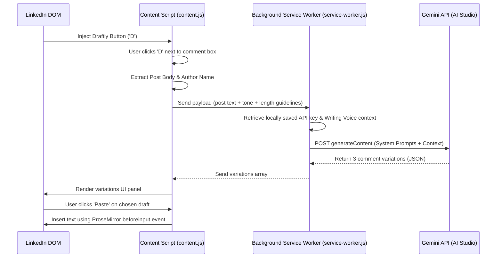

# Draftly

<p align="center">
  
</p>

**Draftly** is a privacy-first, premium Chrome extension that drafts LinkedIn comments in your own voice, using your own Gemini API key. It embeds directly into LinkedIn comment areas, allowing you to generate, review, and paste tailored comments seamlessly.

---

## 🚀 Key Features

- **🗣️ Dynamic Voice Profiling:** Teach Draftly how you write by providing a writing style description (e.g., short, conversational, humorous) and up to 5 real comment examples. The Gemini model studies these to match your sentence structure, rhythm, and tone.
- **🎨 Curated Accent Themes:** Choose from 5 premium, designer-curated color palettes (Teal, Crimson, Gold, Ocean, Pink) and toggle between **Light** and **Dark** modes. The theme changes dynamically across the entire extension.
- **🎭 Adjustable Tones & Lengths:** Instantly customize comments by choosing between **Professional**, **Casual**, or **Insightful** tones, and **Short (~20 words)**, **Medium (~40 words)**, or **Long (~70 words)** outputs.
- **💡 AI-Safety Controls:** Turn emojis on/off and decide whether to end comments with a natural, context-aware follow-up question.
- **🔒 Privacy-First Design:** Your Gemini API key is stored locally on your device using `chrome.storage.local` and is never exposed to content scripts. All data is processed directly via Google's Gemini API — no backend servers, no analytics trackers, no data collection.
- **⚡ Pro Tiptap/ProseMirror Integration:** Draftly utilizes robust injection techniques to insert comments directly into LinkedIn's virtualized editor, ensuring comments persist and survive focus/blur events.

---

## 🛠️ Installation & Setup

To load Draftly locally as a Chrome Extension:

1. Clone or download this repository.
2. Open Google Chrome and navigate to `chrome://extensions/`.
3. Enable **Developer mode** using the toggle switch in the top-right corner.
4. Click the **Load unpacked** button in the top-left corner.
5. Select the `draftly` folder (the directory containing `manifest.json`) from your files.
6. The extension is now loaded! Click the Draftly extension icon in your toolbar to configure settings.

---

## ⚙️ Configuration Guide

1. **Get an API Key:** Navigate to [Google AI Studio](https://aistudio.google.com/) and create a free Gemini API key.
2. **Setup Credentials:** Open the Draftly Settings page and paste your API key.
3. **Configure Voice Style:**
   - Under **Your Style**, describe your unique professional voice (e.g., "I'm a software engineer who writes directly and concisely, avoiding corporate jargon").
   - Add up to 5 real examples of comments you've written in the past to help the model match your exact writing style.
4. **Choose Aesthetics:** Under **Appearance**, select your favorite color palette and toggle dark/light mode.

---

## 🧑‍💻 How it Works & Architecture

Draftly is structured as an unpacked MV3 extension:

```
├── README.md           # Documentation
├── manifest.json       # Chrome Extension Manifest
├── icons/              # Extension logo files (16px, 48px, 128px)
└── src/
    ├── background/
    │   └── service-worker.js  # Manages messages and communicates with Gemini API
    ├── content/
    │   ├── content.js         # DOM Injector, extracts post context, renders UI panel
    │   └── content.css        # Scoped component styles for the comment draft panel
    ├── lib/
    │   └── storage.js         # Chrome storage helper for user settings
    └── options/
        ├── options.html       # Dynamic Settings UI
        ├── options.css        # Settings design system (Light/Dark themes)
        └── options.js         # Settings manager & Character counters
```

### Flow Diagram



---

## 🛡️ Security & Integrity

Draftly does not intercept or track your LinkedIn browsing history.
- The **API key** is held securely in local storage.
- Communication with the Google Gemini API occurs directly from your browser.
- No comment is ever posted without your explicit review and clicking **Paste** -> **Post**.

---

## 👤 Developer

Built with ❤️ by **[Syed Faizan Ali](https://github.com/Faizan1450)**.

- **LinkedIn:** [M. Syed Faizan Ali](https://www.linkedin.com/in/faizan1450/)
- **Portfolio:** [Faizan1450 Portfolio](https://faizan1450.github.io/Portfolio/)
- **Instagram:** [@faizan_1450](https://www.instagram.com/faizan_1450/)
- **Email:** [syedfaizanali1450@gmail.com](mailto:syedfaizanali1450@gmail.com)
